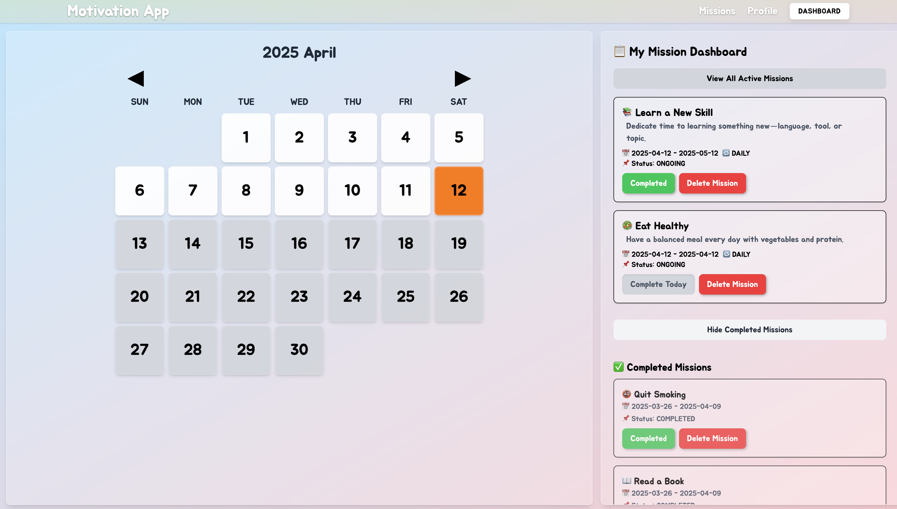

# Motiv-App: 습관 형성 및 목표 달성 플랫폼

## 프로젝트 개요

**Motiv-App**은 사용자가 일상 속 긍정적인 습관을 형성하고 개인 목표를 달성할 수 있도록 도와주는 웹 애플리케이션입니다. 사용자는 다양한 미션을 선택하고, 진행 상황을 추적하며, 성취에 따른 보상을 얻을 수 있습니다.

[🔗 배포된 서비스 바로가기](https://motiv-app-ivory.vercel.app)



## 기술적 역량

### React, TypeScript, Next.js 기반 개발

- App Router 아키텍처를 도입하여 기능 단위의 페이지 구조를 명확히 분리  
- 클라이언트와 서버 로직을 하나의 프로젝트에서 통합적으로 관리  
- React Hooks를 적극 활용하여 모듈화된 상태 관리와 컴포넌트 분리를 구현

**Next.js 선택 이유**  
SSR이 필요 없는 미션 기반 구조에서 App Router를 활용해 페이지와 API를 통합 관리할 수 있었으며,  
클라이언트-서버 간 일관된 구조를 제공해 개발 속도와 유지보수성을 동시에 확보할 수 있었습니다.

---

### Prisma 기반의 데이터 모델링

- 관계형 데이터 모델로 미션, 로그, 뱃지 간의 연관 구조를 명확하게 정의  
- 조건 기반의 통계 평가와 반복성 로직에 적합한 타입 안전 쿼리 제공

**Prisma 선택 이유**  
미션과 뱃지 간의 평가 로직은 반복성과 조건 기반 집계가 핵심이었기 때문에,  
Prisma의 직관적인 스키마 정의와 관계 매핑 기능은 복잡한 데이터 흐름을 단순화하고  
안정적으로 처리할 수 있는 최적의 선택이었습니다.

---

### NextAuth 기반의 인증 시스템

- Google OAuth를 통해 빠르게 로그인 시스템을 구축  
- 세션 기반 인증을 통해 미션 및 로그 데이터에 대한 보안 처리 구현  
- API 및 클라이언트 간 사용자 상태를 안전하고 일관되게 유지

**NextAuth 선택 이유**  
개인별 데이터 보존이 중요한 이 앱에서 인증은 필수였고,  
Next.js 환경에 자연스럽게 통합되며 설정이 간단한 NextAuth를 사용해  
안정적인 인증과 세션 관리를 빠르게 구현할 수 있었습니다.

### 성능 최적화 사례

- **React.memo**와 **useMemo**를 활용한 불필요한 리렌더링 방지로 UI 응답성 **개선**
- 캘린더 컴포넌트의 렌더링 최적화를 통해 대량의 데이터 처리 속도 **20% 향상**

```typescript
// Calendar 컴포넌트 렌더링 최적화 예시
const Calendar = React.memo(({ logs, userMissions }) => {
  const memoizedLogs = useMemo(() => prepareLogsForCalendar(logs), [logs]);
  const memoizedMissions = useMemo(() => 
    userMissions.map(prepareMissionForCalendar), 
    [userMissions]
  );
  
  // ... component implementation
});
```

## 문제 해결 및 추상화 능력

### 만료 미션 자동 처리 시스템

미션이 만료되면 서버에서 자동으로 완료 처리를 수행하는 시스템을 구현했습니다. 이 처리는 백그라운드에서 비동기적으로 실행되어 즉각적인 UI 반영과 빠른 응답 속도를 제공합니다. 처리가 실패한 경우에는 캐시 무효화를 통해 복구됩니다.

```typescript
// lib/utils/missionCompleteHandler.ts
export async function handleMissionComplete(missionId: number, date: Date) {
  try {
    // 백그라운드에서 비동기 처리
    const response = await fetch('/api/complete-mission', {
      method: 'POST',
      headers: { 'Content-Type': 'application/json' },
      body: JSON.stringify({ missionId, date: date.toISOString() })
    });
    
    if (!response.ok) {
      throw new Error('Failed to complete mission');
    }
    
    return true;
  } catch (error) {
    // 실패 시 캐시 무효화
    invalidateCache('user-missions');
    console.error('Error completing mission:', error);
    return false;
  }
}
```

### Optimistic UI 전략

사용자 경험 향상을 위해 서버 응답을 기다리지 않고 UI를 먼저 갱신하는 Optimistic UI 전략을 구현했습니다. 이를 통해 사용자는 액션 후 즉각적인 피드백을 받을 수 있습니다.

예를 들어, "Complete Today" 버튼을 클릭하면 서버 응답을 기다리지 않고 즉시 UI에 완료 상태를 반영합니다:

```typescript
// MissionAction.tsx의 일부
const handleCompleteToday = async () => {
  // 미션 ID와 오늘 날짜 정보
  const missionId = mission.id;
  const today = new Date();
  
  // 1. 낙관적 UI 업데이트 (즉시 UI 반영)
  setOptimisticState(prev => ({
    ...prev,
    [missionId]: { completed: true, loading: true }
  }));
  
  try {
    // 2. 실제 API 호출
    await handleMissionComplete(missionId, today);
    
    // 3. 성공 시 최종 상태 업데이트
    setOptimisticState(prev => ({
      ...prev,
      [missionId]: { completed: true, loading: false }
    }));
    
    // 4. 성공 메시지
    toast.success('Mission completed for today!');
  } catch (error) {
    // 5. 실패 시 롤백 및 에러 처리
    setOptimisticState(prev => ({
      ...prev,
      [missionId]: { completed: false, loading: false }
    }));
    toast.error('Failed to complete mission');
    
    // 6. 데이터 리프레시
    refreshMissions();
  }
};
```

이 패턴은 미션 삭제와 같은 다른 사용자 액션에도 적용되어 앱 전반의 반응성을 높이고 사용자 만족도를 향상시킵니다.

### 코드베이스 개선

프로젝트 초기에는 모든 상태 관리가 단일 컴포넌트에 집중되어 있었습니다. 다음과 같이 리팩토링했습니다:

1. **관심사 분리**: 데이터 로직, UI 로직, 이벤트 핸들링을 분리
2. **코드 모듈화**: 공통 로직을 별도 유틸리티 함수로 추출
3. **타입 안정성 강화**: any 타입 사용을 제거하고 명시적 타입 정의

각 기능별로 분리된 페이지 컴포넌트와 재사용 가능한 UI 컴포넌트의 명확한 구분이 이루어져 있습니다. 
`app/(features)` 디렉토리에 페이지가 구성되고, `components` 디렉토리에 재사용 가능한 컴포넌트들이 체계적으로 분리되어 있습니다.

`lib/utils` 디렉토리에 `missionUtils.ts`와 같은 파일을 통해 비즈니스 로직이 UI 컴포넌트에서 분리되어 있어 테스트 용이성과 유지보수성이 크게 향상되었습니다.

## 코드 구조 및 품질 관리

### 디렉토리 구조

```
motiv-app/
├── app/                    # Next.js App Router 구조
│   ├── (features)/         # 주요 기능별 페이지
│   │   ├── dashboard/      # 대시보드 페이지
│   │   ├── missions/       # 미션 관리 페이지
│   │   └── profile/        # 사용자 프로필 페이지
│   ├── api/                # API 라우트
│   └── ...
├── components/             # 재사용 가능한 컴포넌트
│   ├── calendar/           # 캘린더 관련 컴포넌트
│   ├── dashboard/          # 대시보드 관련 컴포넌트
│   ├── layout/             # 레이아웃 관련 컴포넌트
│   ├── missions/           # 미션 관련 컴포넌트
│   └── ui/                 # 기본 UI 컴포넌트
├── lib/                    # 유틸리티 및 비즈니스 로직
│   ├── hooks/              # 커스텀 훅
│   ├── cache/              # 캐싱 로직
│   └── utils/              # 유틸리티 함수
├── prisma/                 # 데이터베이스 스키마 및 마이그레이션
└── types/                  # TypeScript 타입 정의
```

이 구조는 **관심사 분리 원칙**을 따르며, 각 기능별로 코드를 명확히 구분하여 확장성과 유지보수성을 크게 향상시켰습니다.

### TypeScript 타입 시스템 활용

모듈화된 타입 설계로 코드 일관성과 안정성을 크게 향상시켰습니다:

1. 중복 타입 정의 제거:
```typescript
// 이전: 여러 파일에 분산된 Badge 인터페이스 정의
// badge-ui.ts, badge.ts 등에 중복 정의

// 개선: types/badge.ts로 통합 관리
export interface Badge {
  id: number;
  title: string;
  description?: string;
  condition: string;
  rank: number;
}
```

2. 명시적 타입 파싱:
```typescript
// 이전: API 응답을 임의로 타입 단언 (as Type)

// 개선: DTO 타입으로 명시적 파싱
interface BadgeResponse {
  id: number;
  title: string;
  description: string | null;
  condition: string;
  rank: number;
}

// 응답 데이터를 명시적으로 변환
const parseBadge = (data: BadgeResponse): Badge => ({
  id: data.id,
  title: data.title,
  description: data.description || undefined,
  condition: data.condition,
  rank: data.rank
});
```

3. 공통 유니언 타입 도입:
```typescript
// 이전: 문자열 타입 사용 (type: string)

// 개선: 명확한 유니언 타입 정의
export enum MissionType {
  HEALTH = "HEALTH",
  SELF_DEVELOPMENT = "SELF_DEVELOPMENT",
  PRODUCTIVITY = "PRODUCTIVITY",
  MINDFULNESS = "MINDFULNESS",
  RELATIONSHIP = "RELATIONSHIP"
}

export enum MissionRepeatType {
  DAILY = "DAILY",
  WEEKLY = "WEEKLY",
  MONTHLY = "MONTHLY",
  CUSTOM = "CUSTOM"
}

export enum Status {
  ONGOING = "ONGOING",
  COMPLETED = "COMPLETED",
  FAILED = "FAILED"
}
```

4. 캐시 시스템을 위한 타입 정의:
```typescript
// lib/cache/serverCache.ts
interface CacheEntry<T> {
  data: T;
  timestamp: number;
}

export function cacheData<T>(key: string, data: T, expirationMs: number): void {
  const entry: CacheEntry<T> = {
    data,
    timestamp: Date.now() + expirationMs
  };
  // 캐시 저장 로직
}
```

이러한 타입 시스템 설계로 코드의 가독성을 향상시키고 타입 안전성을 확보했습니다.

## 자세히 봐주었으면 하는 부분

1. **lib/utils/missionCompleteHandler.ts**: 만료된 미션을 백그라운드에서 비동기적으로 처리하는 로직입니다. 사용자 경험을 저해하지 않으면서 서버 상태를 일관되게 유지하는 방법을 구현했습니다.

2. **components/missions/MissionAction.tsx**: Optimistic UI 패턴을 적용하여 사용자 액션에 즉각적인 피드백을 제공하는 컴포넌트입니다. 서버 요청 실패 시 롤백 메커니즘도 포함하여 안정성을 확보했습니다.

3. **components/dashboard/MissionList.tsx**: 미션 목록을 효율적으로 렌더링하고, 사용자 상호작용을 처리하는 컴포넌트입니다. 대량의 미션 데이터를 효율적으로 처리하기 위한 최적화 기법이 적용되어 있습니다.

4. **types/** 디렉토리: 애플리케이션 전반에 걸쳐 일관된 타입 시스템을 구축하여 코드 품질과 개발자 경험을 향상시켰습니다.

## 향후 개선 방향

- **웹소켓 통합**: 여러 장치 및 탭에서 미션 상태를 실시간으로 동기화하여 사용자 경험 개선
- **크롬 확장 프로그램 개발**: 브라우저에서 직접 접근하여 미션을 관리할 수 있는 확장 프로그램 구현
- **오프라인 지원**: Service Worker를 활용한 오프라인 모드 지원으로 네트워크 연결 없이도 앱 사용 가능

## 기술 스택

- **Frontend**: React, Next.js, TypeScript
- **Styling**: Tailwind CSS
- **State Management**: Custom Hooks
- **Backend**: Next.js API Routes
- **Database**: PostgreSQL with Prisma ORM
- **Authentication**: NextAuth (Google OAuth)


[자세한 설명은 블로그 글 참고](https://dev-portfolio-two-wheat.vercel.app/MotivationAppV2)

